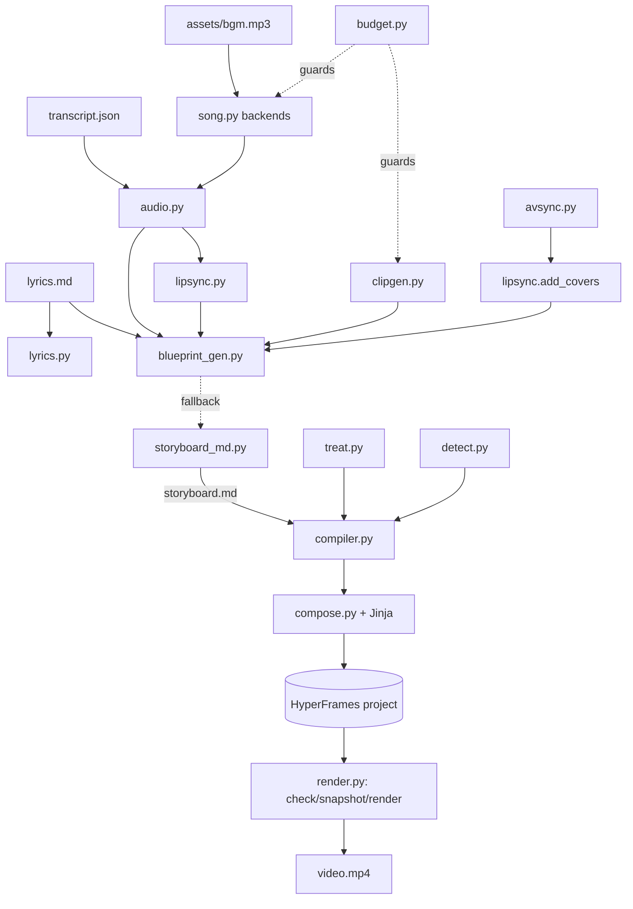

# slopcore-factory — SPEC

A headless factory that turns a **song folder** (lyrics + a storyboard + the song and
footage) into a **HyperFrames project** and, optionally, a rendered MP4. It exists to
reproduce the hand-authored motion design of `please-continue-video` / `all-hours-video`
for any song, without the HyperFrames Studio UI, and to plan lipsync the way the ESCAPE
VELOCITY production did (audio-conditioned windows, measured drift, covers).

## 1. Goals and non-goals

Goals
- Input: a song folder with `lyrics.md`, a storyboard (`storyboard.md`), the audio, and
  the footage. Output: a video file, plus an editor-friendly timeline.
- A machine-readable **blueprint** that carries the whole creative plan: chapters, shots,
  lyric type placement, camera, clip picks, assets, animation, lipsync windows, budget.
- Pluggable, **no-spend-by-default** generation: supplied files first; paid/local
  generation only when explicitly asked.
- Every stage runnable and cached; a REPL over the whole thing.

Non-goals
- No Studio/GUI. No image/plate generation (assets are supplied).
- No LatentSync or other fallback model; lipsync is measure -> cut -> cover.
- No ORM; no database.

## 2. Architecture

Vertical slices around a shared model; a thin orchestrator drives the stages. HTML/JS live
in Jinja templates, never in Python strings.



## 3. Data model

The source of truth is `slopcore_factory/blueprint.py::Blueprint`:

- `Character` — written canon + reference images + identity notes.
- `Chapter` — a time range with grade/accent/screen/set.
- `Shot` — `t0..t1`, framing, action, camera, `motion_tier` (code|plate25d|seedance),
  `lines`, `type` (per lyric line: mode subtitle|coverline|masthead|mass|plate + position),
  `assets` (plate, depth, tracking), `animation` (scene/module). Also `media` (explicit
  background override: a still or a treated clip), `treatment`
  (loop|slow|pingpong|hold|stutter) with `treatment_value`, and `detections` (YOLO boxes
  at shot-local times). `ShotType.position` (`left|right|center|lower|upper|bottom`) and
  `offset` (seconds, + is later) are carried onto the compiled `Cue`, so one lyric line
  can sit lower or be nudged in time without moving the rest.
- `SeedanceClip` — a moving shot; audio-conditioned when `sing`; `path` once resolved;
  `use_reference` controls whether the character images are sent with it (false for shots
  whose subject is the user/scramble suit, which is text-only).
- `Plate` — a still the user supplies.
- `LipsyncWindow` — a 4-8 s window that starts in a word gap and quotes exact words.
- `AnimationScene` — a named motion-design scene over a chapter.
- `Budgets` — cap + estimates + `retry_buffer` (default 1.35; 1.0 = one-shot, no retry
  planning).

Invariants (`validate_blueprint`): shots tile `0..duration` with no gaps; ids unique;
seedance shots name a known clip; treatments known; type modes/positions known; lipsync
windows inside the song and on known clips.

The **render plan** (`models.Storyboard` -> `Frame` -> `Group` -> `Cue`) is what `compose`
consumes; `compiler.blueprint_to_storyboard` builds it from the blueprint.

### The plan file — `storyboard.md`

`storyboard.md` (beside `lyrics.md`) is the source of truth: strict markdown, one table per
concern. `storyboard_md.py` renders it (`render` / `plan_text` / `write_plan`) and parses it
back (`parse` / `load_plan`), so editing the markdown IS the edit. Sections:

| section | rows |
|---|---|
| `settings` | canvas, fps, duration, theme, lyrics, audio, budget_usd, retry_buffer, seedance_quality, version, dry_run |
| `character` | name, canon, identity_notes, reference_images |
| `chapters` | id, name, start, end, grade, accent, screen, set |
| `shots` | shot, start, end, chapter, framing, tier, clip, treatment, scene, media |
| `lyrics` | line, start, text, mode, position, offset |
| `prompts/song` | the song style sent to Suno (a fenced block) |
| `prompts/clips` | clip, sing, duration, reference, prompt (sent to Seedance) |
| `lipsync` | clip, start, duration, words, framing |
| `animation` | id, chapter, start, end, module, notes |
| `plates` | plate, set, aspect, depth, prompt |

The plan stage loads it; the song style round-trips in `Blueprint.meta["song_style"]`. The
decorative blueprint fields (`action`, `camera`, `lift`, `meme_visual`, per-shot `assets`,
`detections`) are not represented and default on load.

## 4. Pipeline stages

`song -> align -> beats -> media -> plan -> build -> check -> [snapshot] -> render`, plus
out-of-band commands (`blueprint`, `storyboard`, `treat`, `lipsync`, `clips`, `avsync`,
`covers`, `review`, `overlay`).

- `song` — resolve audio via a backend (see 5).
- `align` — word timings: reuse `transcript.json` when present, else whisper.
- `beats` — reuse `audiomap.json` when present, else librosa (optional).
- `media` — background footage: `--background`, else `assets/clips/*`, else a synth plate.
- `plan` — **compile from the plan**: `storyboard.md` beside the lyrics when it exists
  (the authority), else the legacy `work/blueprint.yaml`, else the deterministic planner.
  First apply per-shot **media treatments** (`treat.py`: ffmpeg slow with frame
  interpolation, pingpong, hold, stutter) so a clip fills its shot without a visible loop,
  then **YOLO detections** (`detect.py`, lazy ultralytics) so each shot carries real
  object boxes.
- `build` — render the project (Jinja) and write metadata + scene registry.
- `check` / `snapshot` / `render` — the HyperFrames CLI, pinned version.

Out-of-band `clips` resolves the blueprint's Seedance entries: up to 6 `assets/ref/*`
character images are uploaded once and attached to clips whose `use_reference` is true;
audio slices for `sing` clips are cut and hosted; a clip whose `.mp4` already exists is
reused, so a paid run resumes after a failure; a failed attempt can be retried with a
recorded `--supersede-reason`.

Out-of-band `overlay` composes a text-only, transparent variant (no clips, scenes,
kicker, scrim or grain) and renders the lyrics-only layer as a ProRes 4444 MOV with
alpha (`--format mov --workers 1`), for layering in an NLE.

Stages are hash-cached (`cache.py`); `--force` redoes them. Render outputs never
overwrite: `name.mp4`, `name-2.mp4`, ...

## 5. Song backends

`localgen.py` + `song.py` + `cli._song_provider`:

| backend | behaviour |
|---|---|
| `supplied` (default) | use the file already in the folder; never calls an API |
| `suno` | EvoLink Suno (paid), guarded; keeps all takes |
| `dryrun` | local placeholder (ffmpeg sine) for free end-to-end runs |
| `yue` | YuE2 via `SLOPCORE_YUE_CMD` (see `tools/yue2_wrapper.py`) |
| `ace_step` | ACE-Step via `SLOPCORE_ACE_STEP_CMD` |

The local backends run a user command with `--request <json> --out <audio>`; the request
holds title, lyrics, style, duration, seed. YuE2 generation was confirmed to start on CPU
(it reached audio synthesis) but is not vendored (large, slow, non-commercial weights).
A Suno task that fails server-side is not charged; retry it with `--supersede-reason`
(recorded in the ledger). Suno's `duration` is a target (10-360 s on v6); it may end the
vocal early, so verify the take before aligning.

## 6. Lipsync and avsync

- `audio.find_gaps` — silences between words (the prerequisite).
- `lipsync.plan_windows` — 4-8 s windows that start in a gap, quote the exact words,
  alternate framing.
- `lipsync.plan_clips` — audio-conditioned Seedance prompts (`@Image1 sings @Audio1 …`).
- `avsync.detect_divergence` — sliding correlation of energy envelopes; first drift time.
- `lipsync.plan_cover` / `add_covers` — resume at the last word gap before the drift.
- No fallback model (user decision).

## 7. Animation scenes

`scenes.py` + `templates/partials/scenes.*.j2` + `Frame.scenes`:

- Built-ins `bars`, `marquee`, `scan`, `blocks`, and `yolo` (real detection boxes, timed
  to their sample).
- A shot's `animation.module` points at a user HTML fragment copied into `scenes/` and
  inlined (arbitrary animation escape hatch).
- Every project gets `scenes/registry.json` + `scenes/README.md`.

## 8. Budget

`budget.estimate` (Seedance seconds x rate x `retry_buffer` + plates + song) and
`budget.guard` (refuses a paid step over `cap_usd`). `slopcore-hf` rates are preferred
when importable. `retry_buffer` is per-song: set 1.0 for a strict one-attempt-per-clip run.

## 9. Surfaces

CLI: `init song align plan build check snapshot render run status blueprint storyboard
analyze lipsync clips avsync covers review overlay repl`. `storyboard` takes `print`
(default) / `write` / `run`; the REPL adds `storyboard shot <id>` and `treat`
(`list` | `<shot>` | `<shot> <treatment> [value]`), plus `dryrun on|off` and `takes`.

## 10. Testing

104+ pytest tests, all offline: models, lyrics, timing/align, storyboard, storyboard
markdown (render + parse round-trip), compose (incl. the text-only overlay), blueprint
schema + validation, budget, dry-run providers, clip resolution + reuse + reference
payloads, song supersede plumbing, media treatments, YOLO detection (fake model), scenes,
avsync on synthetic wavs, covers, compiler (per-line position + timing offset), review,
REPL, and the yue2 adapter (against a fake yue2 CLI). `ruff check` + `ruff format` clean.

## 11. Repo layout

```
slopcore_factory/        package
  models.py blueprint.py compiler.py scenes.py
  lyrics.py timing.py audio.py lipsync.py avsync.py
  song.py localgen.py clipgen.py dryrun.py
  treat.py detect.py      per-shot media treatments + YOLO detections
  storyboard.py storyboard_md.py blueprint_gen.py theme.py compose.py render.py
  budget.py pipeline.py workflows.py cli.py repl.py
  templates/             Jinja (index, frame, partials, storyboard.plan.md)
tools/yue2_wrapper.py    adapter for the yue backend
tests/                   pytest suite
songs/<song>/            generated projects
songs/<song>.work/       work dir (blueprint, cues, treated, detections, cache, logs)
```

## 12. Decisions

- HyperFrames only (MoviePy declined).
- Assets supplied, not generated.
- No API calls by default; supplied-first.
- Lipsync: measured, no fallback model.
- Storyboard is the input contract; the planner is a fallback. `storyboard.md` (strict
  markdown, beside the lyrics) is the authority the pipeline loads (parsed back into the
  blueprint + cues); `blueprint.yaml` is a legacy fallback.
- Character references: AI refs only for operator shots; user/scramble-suit shots are
  text-only (`use_reference: false`).
- Paid runs are one-shot per artifact; a failed attempt is retried with a recorded
  `--supersede-reason`, and completed clips are reused on resume.
- Per-shot media treatments avoid the loop repeat; slow motion uses frame interpolation.
- Object boxes are real YOLO detections, not decorative rectangles.
- Render outputs never overwrite (`name`, `name-2`, ...); the lyrics layer exports as a
  transparent ProRes 4444 MOV for NLE assembly.
- The lyrics overlay is text only: media, scenes (incl. YOLO) and the kicker are dropped.
- A lyric line's `ShotType.position` reaches the template, so one line can sit lower
  (`bottom`) than the default baseline.
- Lyric lines default to ~80% of the frame height (`bottom: 8cqw`); hook words sit a
  touch lower (`bottom: 6cqw`).
- A line can be nudged in time with `ShotType.offset` (seconds); "I'll keep it on" is
  delayed 3 s.
