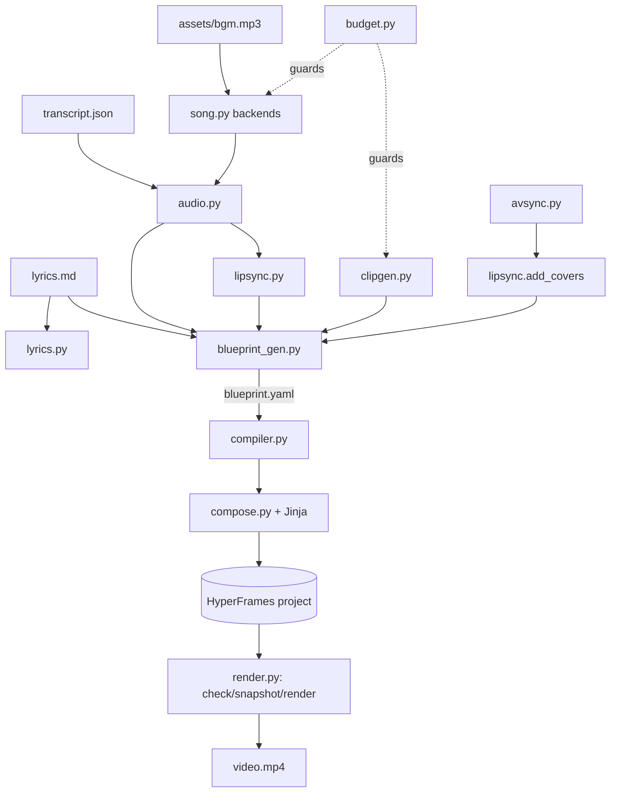

# slopcore-factory — SPEC

A headless factory that turns a **song folder** (lyrics + a storyboard + the song and
footage) into a **HyperFrames project** and, optionally, a rendered MP4. It exists to
reproduce the hand-authored motion design of `please-continue-video` / `all-hours-video`
for any song, without the HyperFrames Studio UI, and to plan lipsync the way the ESCAPE
VELOCITY production did (audio-conditioned windows, measured drift, covers).

## 1. Goals and non-goals

Goals
- Input: a song folder with `lyrics.md`, a storyboard (`blueprint.yaml`), the audio, and
  the footage. Output: a video file.
- A machine-readable **blueprint** that carries the whole creative plan: chapters, shots,
  lyric type placement, camera, clip picks, assets, animation, lipsync windows, budget.
- Pluggable, **no-spend-by-default** generation: supplied files first; paid/local
  generation only when explicitly asked.
- Every stage runnable and cached; a REPL over the whole thing.

Non-goals
- No Studio/GUI. No image/plate generation (assets are supplied).
- No LatentSync or other fallback model; lipsync is measure -> cut -> cover.
- No ORM; no database.

## 2. Architecture

Vertical slices around a shared model; a thin orchestrator drives the stages. HTML/JS live
in Jinja templates, never in Python strings.



## 3. Data model

The source of truth is `slopcore_factory/blueprint.py::Blueprint`:

- `Character` — written canon + reference images + identity notes.
- `Chapter` — a time range with grade/accent/screen/set.
- `Shot` — `t0..t1`, framing, action, camera, `motion_tier` (code|plate25d|seedance),
  `lines`, `type` (per lyric line: mode subtitle|coverline|masthead|mass|plate + position),
  `assets` (plate, depth, tracking), `animation` (scene/module).
- `SeedanceClip` — a moving shot; audio-conditioned when `sing`; `path` once resolved.
- `Plate` — a still the user supplies.
- `LipsyncWindow` — a 4-8 s window that starts in a word gap and quotes exact words.
- `AnimationScene` — a named motion-design scene over a chapter.
- `Budgets` — cap + estimates.

Invariants (`validate_blueprint`): shots tile `0..duration` with no gaps; ids unique;
seedance shots name a known clip; type modes/positions known; lipsync windows inside the
song and on known clips.

The **render plan** (`models.Storyboard` -> `Frame` -> `Group` -> `Cue`) is what `compose`
consumes; `compiler.blueprint_to_storyboard` builds it from the blueprint.

## 4. Pipeline stages

`song -> align -> beats -> media -> plan -> build -> check -> [snapshot] -> render`, plus
out-of-band commands (`blueprint`, `lipsync`, `clips`, `avsync`, `covers`, `review`).

- `song` — resolve audio via a backend (see 5).
- `align` — word timings: reuse `transcript.json` when present, else whisper.
- `beats` — reuse `audiomap.json` when present, else librosa (optional).
- `media` — background footage: `--background`, else `assets/clips/*`, else a synth plate.
- `plan` — if `work/blueprint.yaml` exists, **compile from it**; else the deterministic planner.
- `build` — render the project (Jinja) and write metadata + scene registry.
- `check` / `snapshot` / `render` — the HyperFrames CLI, pinned version.

Stages are hash-cached (`cache.py`); `--force` redoes them.

## 5. Song backends

`localgen.py` + `song.py` + `cli._song_provider`:

| backend | behaviour |
|---|---|
| `supplied` (default) | use the file already in the folder; never calls an API |
| `suno` | EvoLink Suno (paid), guarded; keeps all takes |
| `dryrun` | local placeholder (ffmpeg sine) for free end-to-end runs |
| `yue` | YuE2 via `SLOPCORE_YUE_CMD` (see `tools/yue2_wrapper.py`) |
| `ace_step` | ACE-Step via `SLOPCORE_ACE_STEP_CMD` |

The local backends run a user command with `--request <json> --out <audio>`; the request
holds title, lyrics, style, duration, seed. YuE2 generation was confirmed to start on CPU
(it reached audio synthesis) but is not vendored (large, slow, non-commercial weights).

## 6. Lipsync and avsync

- `audio.find_gaps` — silences between words (the prerequisite).
- `lipsync.plan_windows` — 4-8 s windows that start in a gap, quote the exact words,
  alternate framing.
- `lipsync.plan_clips` — audio-conditioned Seedance prompts (`@Image1 sings @Audio1 …`).
- `avsync.detect_divergence` — sliding correlation of energy envelopes; first drift time.
- `lipsync.plan_cover` / `add_covers` — resume at the last word gap before the drift.
- No fallback model (user decision).

## 7. Animation scenes

`scenes.py` + `templates/partials/scenes.*.j2` + `Frame.scenes`:

- Built-ins `bars`, `marquee`, `scan` — pure-function GSAP tweens, seek-safe.
- A shot's `animation.module` points at a user HTML fragment copied into `scenes/` and
  inlined (arbitrary animation escape hatch).
- Every project gets `scenes/registry.json` + `scenes/README.md`.

## 8. Budget

`budget.estimate` (Seedance seconds x rate x retry buffer + plates + song) and
`budget.guard` (refuses a paid step over `cap_usd`). `slopcore-hf` rates are preferred
when importable.

## 9. Surfaces

CLI: `init song align plan build check snapshot render run status blueprint analyze lipsync
clips avsync covers review repl`. REPL mirrors all of it, plus `dryrun on|off` and `takes`.

## 10. Testing

75+ pytest tests, all offline: models, lyrics, timing/align, storyboard, compose, blueprint
schema + validation, budget, dry-run providers, clip resolution, avsync on synthetic wavs,
covers, compiler, scenes, review, REPL, and the yue2 adapter (against a fake yue2 CLI).
`ruff` + `black` clean.

## 11. Repo layout

```
slopcore_factory/        package
  models.py blueprint.py compiler.py scenes.py
  lyrics.py timing.py audio.py lipsync.py avsync.py
  song.py localgen.py clipgen.py dryrun.py
  storyboard.py blueprint_gen.py theme.py compose.py render.py
  budget.py pipeline.py workflows.py cli.py repl.py
  templates/             Jinja (index, frame, partials, storyboard)
tools/yue2_wrapper.py    adapter for the yue backend
tests/                   pytest suite
songs/<song>/            generated projects
songs/<song>.work/       work dir (blueprint, cues, analysis, cache, logs)
```

## 12. Decisions

- HyperFrames only (MoviePy declined).
- Assets supplied, not generated.
- No API calls by default; supplied-first.
- Lipsync: measured, no fallback model.
- Storyboard is the input contract; the planner is a fallback.
